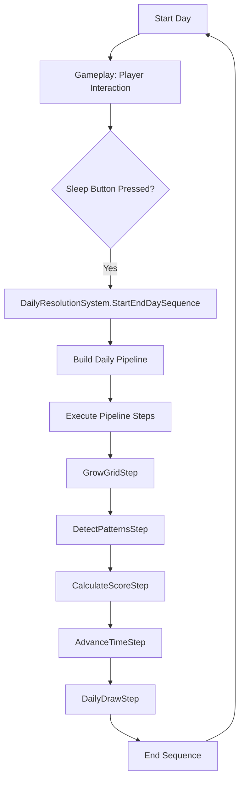
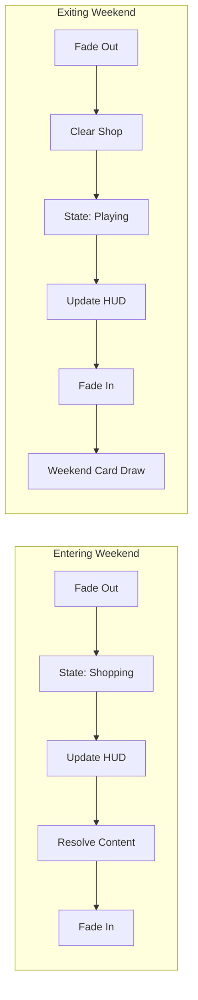
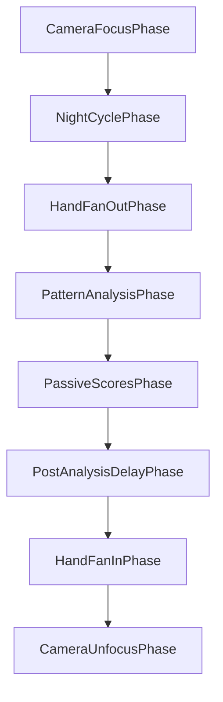

# 🗺️ Master Flow Map - LAST FURROW

> **Status:** Active Documentation (v1.1)
> **Last Update:** 2026-02-03 (Arch Refactor)
> **Description:** This document serves as the "Single Source of Truth" for the game's high-level logic flow and system interactions.

---

## 🔄 1. The Core Game Loops

The game operates on two main cycles: the **Daily Production Cycle** (Monday to Friday) and the **Weekend Shopping Cycle** (Saturday/Sunday).

### A. Daily Cycle (Monday - Friday)
The player places crops and interacts with the grid. The cycle ends when the "Sleep" button is pressed.

### B. Weekend Transition
When the day advances and reaches Day 6 (Saturday), the `DayTransitionModule` (or similar) triggers the Weekend Flow.

---

## � 2. Grid Analysis Flow

The Grid Analysis is the most complex part of the Daily Resolution. It is split into **Logic Detection** and **Visual Performance**.

### Phase 1: Logic Detection (`DetectPatternsStep`)
Before any animation starts, the system calculates everything:

1.  **Scanner:** Iterates through all Grid Slots.
2.  **Factory:** `PatternDetectorFactory` provides specialized detectors (Line, Cross, Frame, Trio, etc.).
3.  **Validation:** Each detector checks if the crops in the slots match its specific requirements.
4.  **Result:** Generates an `AnalysisResult` containing all `PatternMatches`.

### Phase 2: Visual Pipeline (`AnalyzingPhaseOrchestrator`)
Once logic is done, the game plays a sequence of "Visual Phases":

*   **PatternAnalysisPhase:** This is where the patterns actually "pop", animations play, and score is added to the HUD.
*   **PassiveScoresPhase:** Calculates and displays extra points from Card Traits or global modifiers.

---

## �🛠️ 3. System Architecture

### 🌊 The Flow System (`Assets/Scripts/Flow`)
The game uses a **Pipeline/Step** architecture. Instead of complex transitions, we define a list of `IFlowStep` and execute them sequentially via `PipelineExecutor`.

*   **Executor:** Handles async timing (UniTask), errors, and rollbacks.
*   **Builders:** Responsible for the **Order** and **Injection** of dependencies.
*   **Contexts:** Data containers that travel through the pipeline (Logic vs Visual).

### 🌾 Domain Logic (`Assets/Scripts/Domain`)
*   **GridService:** The "Brain" of the grid. Manages slots, crops, and state.
    *   **Refactoring (2026-02):** Migrated to a **Unified "Rich" Event System** (`OnGridChanged`).
    *   **Architecture:** Push-based. The service emits a `GridChangeEvent` containing a full `Snapshot` of the slot. Listeners (UI/Save) no longer need to query the service ("Pull") to update.
    *   **Legacy:** `OnSlotStateChanged`, `OnSlotUpdated`, and `OnDataDirty` were removed.
*   **HealthService:** (NEW) Manages player lives, healing, and damage rules. Decoupled from data.
*   **PatternDetector:** Stateless logic that scans the grid for specific shapes.
*   **PatternCalculator:** Assigns values and scores to detected patterns.
*   **EconomyService:** Manages Gold and Meta-progression currency.

### 📊 Progression (`Assets/Scripts/Progression`)
*   **RunData:** "Pure Data" container. Holds the permanent state of the run (Day, Week, Score, Deck, Grid). No business logic.
*   **GoalSystem:** Checks if the player met the weekly quota to continue.

---

## � 4. Traditions & Cards (Input vs Rules)

These two systems represent the **How** and the **Why** of the gameplay.

### 🃏 The Card System (`Assets/Scripts/Cards`)
Cards are the player's tools to interact with the world.
*   **Action Layer:** Cards execute `Commands` (Plant, Clear, Water) via `CardCommandExecutor`.
*   **Deck Management:** Handled by `DailyHandSystem`, which draws cards according to a `CardDrawPolicy`.
*   **Decoupling:** Cards only know how to modify the Grid or Economy; they don't know about the "Scoring Rules" (Traditions).

### 🏺 The Traditions System (`Assets/Scripts/Traditions`)
Traditions are the "Passive Talent Tree" of your run.
*   **Loadout:** Managed by `TraditionService`. Active traditions are stored in `RunData`.
*   **Effects:** Traditions implement `ITraditionEffect` (e.g., `PatternTypeBonusEffect`).
*   **Injection:** They are injected into the `DailyResolutionContext` to be evaluated during the analysis phase.

### 🔗 The Synergy (The "Meeting Point")
Cards and Traditions meet at the **Grid Analysis Flow**:
1.  **Input:** The player uses **Cards** to place crops in specific patterns.
2.  **Detection:** The `DetectPatternsStep` finds those patterns.
3.  **Amplification:** The **Traditions** scan the detected patterns and apply bonuses (Score/Gold multipliers).
    *   *Direct link:* If a card places a "Trio", and you have a Tradition that buffs "Trios", the card's value is indirectly increased by the Tradition.

---

## �🚨 5. Critical Failure Points (Debug Checklist)

If the game "freezes", check these common culprits:

1.  **Pipeline Hang:** A `UniTask` in a step (like `DetectPatternsStep`) is waiting for an animation event that never fired.
2.  **State Mismatch:** `GameStateManager` stuck in `Shopping` mode while visual objects are in the `Playing` scene.
3.  **Null Visual Context:** Running the `DailyResolutionSystem` without a `DailyVisualContext` (Analyzer/Scanner) will trigger warnings or skips.

---

## 🧪 6. Testing & Validation
*   **Unit Tests:** Found in `Assets/Scripts/Tests`. Use them to validate business rules (Score, Pattern detection) without opening Unity.
*   **Debug Commands:** Use `Assets/Scripts/DebugSystem` to jump between days or force-add gold for testing transitions.

---
*This document is active. If you refactor a Pipeline or a Core System, update the Mermaid diagrams immediately.*
